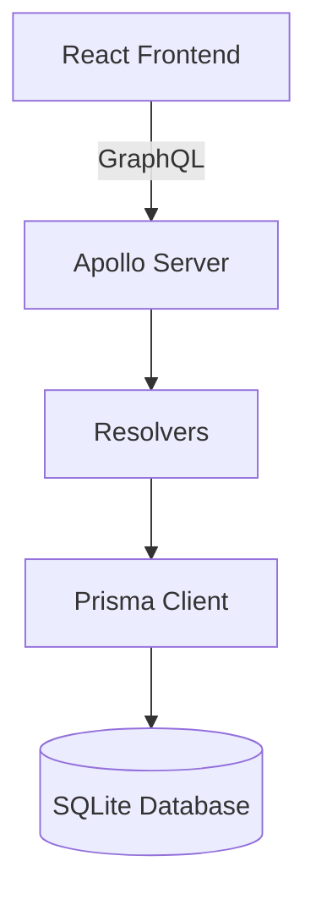
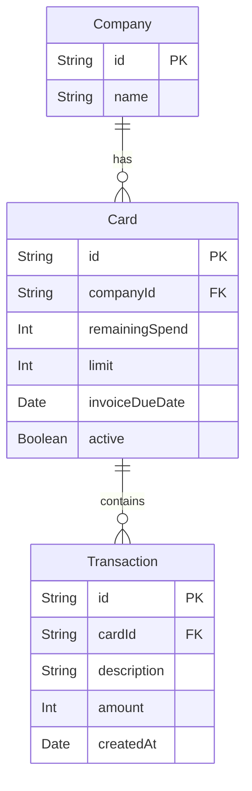

# Company Card Dashboard

This is a simple full-stack project with a React frontend and a Node.js backend using GraphQL, Apollo Server, Prisma, and SQLite.

---

## 🧱 Project Structure

```
/
├── backend/
│   ├── src/               # Apollo GraphQL server with resolvers
│   ├── prisma/            # Prisma schema
│   └── scripts/           # Startup scripts
└── frontend/
    └── src/               # React app
```

---

## ▶️ How to Run

### 1. Clone the repo

```bash
git clone <repo-url>
cd <project-folder>
```

---

### 2. Start the backend

```bash
cd backend
npm install
npm run start
```

```bash
# If above doesn't work you can run the docker file with:
docker compose up --build

# or manually run the scripts: 
npm run migrate        # Run DB migrations
npm run seed           # Seed the database
npm run generate-graphql-schema  # Generate GraphQL codegen
npm run dev            # run index.ts
```

This will:

- Run Prisma migrations
- Seed the database
- Generate GraphQL types
- Start the dev server at `http://localhost:4000`

---

### 3. Start the frontend

```bash
cd frontend
npm install
npm run dev
```

This will start the React app at `http://localhost:5173`

---

## 🗃️ System Architecture



---

## 🧩 Database Schema



---

## ⚙️ Developer Notes

- **Backend:**
  - Apollo Server (GraphQL)
  - Prisma (ORM)
  - SQLite (local dev database)
  - Codegen for GraphQL types
- **Frontend:**
  - React (with Apollo Client)
  - TailwindCSS
  - Codegen for typed GraphQL queries

---
